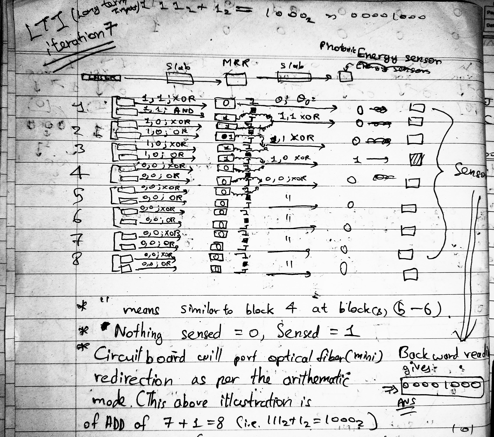

# Photonic-Processing-Unit
**Latest: LTI 2**

Below are the chronological engineering logbook passes for the Long Term Iteration (LTI) , mapped out to track  hardware constraints:

### LTI  1: Converging Dual-Beam Logic
*Differential refractive index filtering via non-parallel input vectors.*

### LTI  2: 8-Bit Photonic Ripple Carry Adder (RCA) Core
*The complete single-core schematic showing the 16-laser matrix, 24 uniform crystal slabs, 48 actuation motor axes, and the 1:1 micro-scale Microring Resonator (MRR) register tracks connected to mini optical fiber carry loops.*

NOTE: If you are thinking that I am just sitting frozen for validation, then you are wrong, as there is nothing much left to do; if I did, it would be an "in-air talk", so this is the peak theory limit
and now needs practical performance to develop it further
